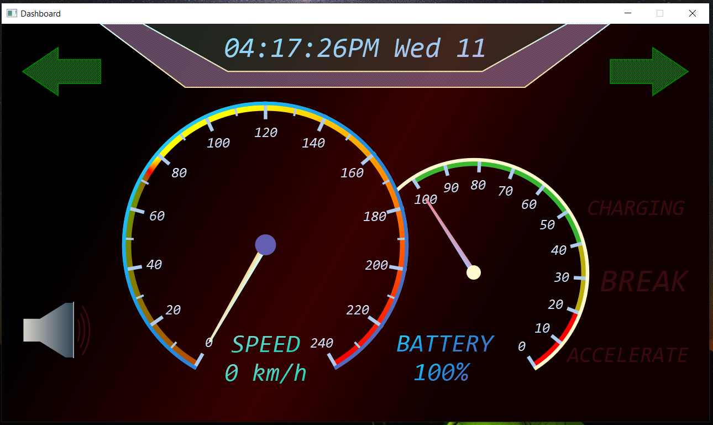

This project aims to develop a digital dashboard for an electric car. The main goal is to simulate an interactive dashboard that provides users with relevant real-time information such as current speed, battery level, signal indicators and other typical features of a modern vehicle.
For developing the interface, I used
PyQt5
framework, and for the functionalities,
Python. For creating the objects, I have used
Object-Oriented Programming
principles.

  
The dashboard can be controlled from the push-buttons, connected to a Raspberry Pi 4B.

